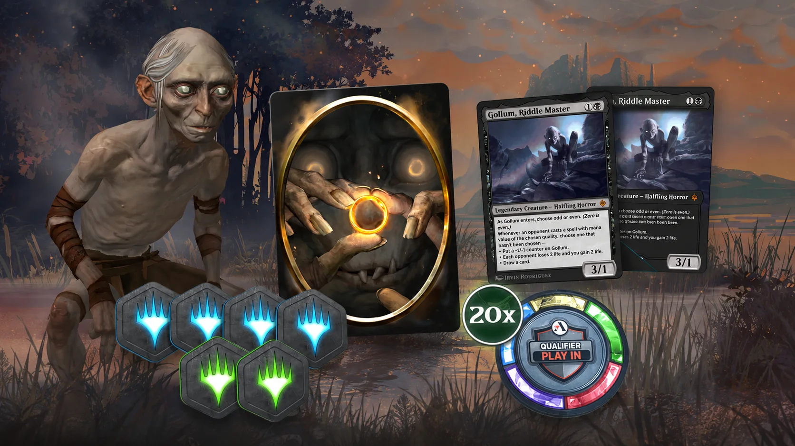



La meva mitjana als Premier Drafts aquesta temporada és de 3,14 victòries (22 victòries i 18 derrotes repartides en 7 drafts). He pagat les set entrades amb  i he obtingut  en recompenses, de manera que el saldo ha passat de  a , amb una pèrdua neta de . El resultat de 7-0 ha estat especialment important per contenir la pèrdua global de la temporada.

Aquest més he comprat el Play Bundle de  principalment per les 6 fitxes de Limited que inclou:  i 
