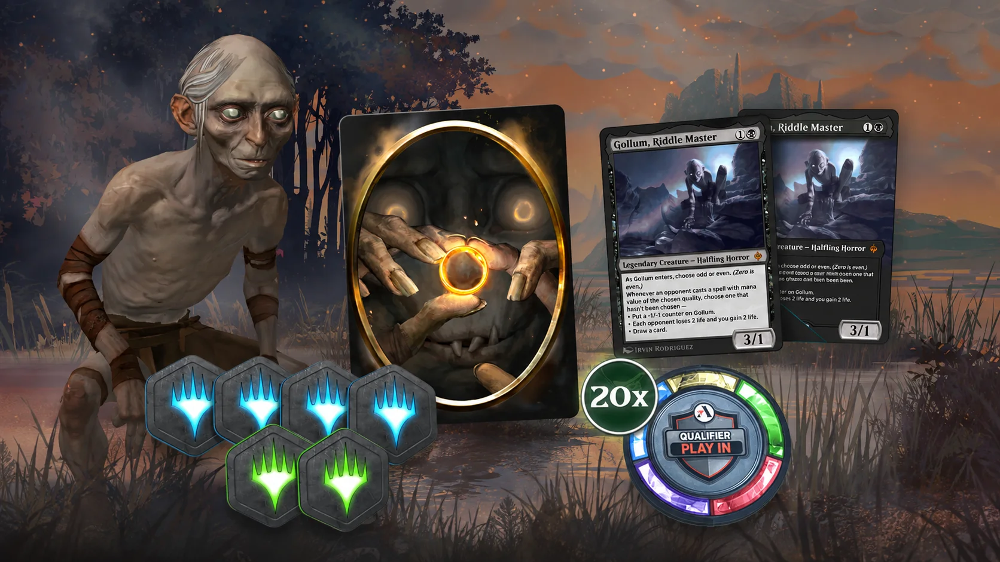



Als Premier Drafts he aconseguit 61 victòries i 75 derrotes en 26 esdeveniments: una mitjana de 2,35 victòries per draft i un percentatge de victòries del 44,9%. El 7-0 i els altres bons resultats han ajudat a contenir la pèrdua global, però els sis 0-3 han pesat molt en el balanç final. Les recompenses dels drafts han sumat .

També he jugat quatre Sealed de , amb resultats de 4-3, 1-3, 5-3 i 0-3: 10 victòries, 12 derrotes i  en recompenses. He pagat les quatre entrades amb : les dues que conservava del Play Bundle de MSH i les dues incloses al de HOB. En total, doncs, he jugat 30 esdeveniments de Limited amb un resultat combinat de 71-87 i he guanyat  en premis.

Vaig tancar l'agost amb , cosa que representa una pèrdua neta de  durant la temporada.

Aquest mes he comprat el Play Bundle de  principalment per les 6 fitxes de Limited que inclou:  i .
