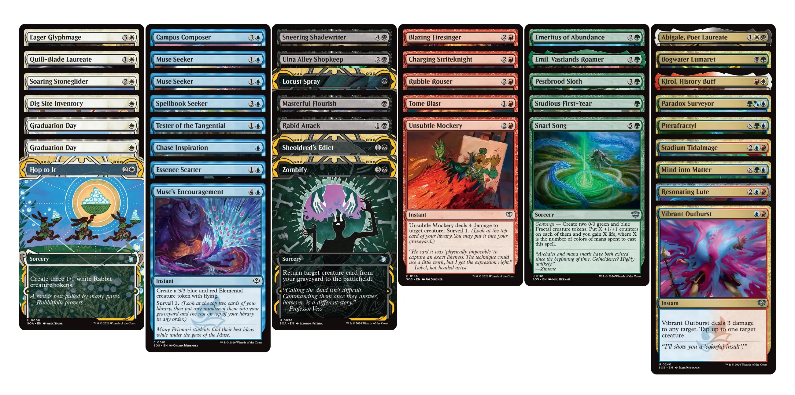

Quan em vaig plantejar [tornar a l'Arena](/ca/posts/back-to-mtg-arena) per jugar _Limited_, vaig llegir un [post a Reddit](https://www.reddit.com/r/MagicArena/comments/18ovjgi/a_f2p_beginner_draft_guide/) (molt recomanable) on l'autor comenta que si jugues drafts durant la primera setmana de la temporada (les temporades duren un mes natural, normalment) és més probable que et toquin rivals més experimentats i, per tant, les opcions de guanyar es redueixen.

Veient com m'ha anat la setmana, segurament sigui veritat. També he après que, durant la temporada, no només hi ha drafts de l'expansió actual, si no que se'n fan d'expansions anteriors que només estan disponibles uns quants dies. Aquest mes, per exemple, es pot jugar [Avatar, The Last Airbender (TLA)](https://scryfall.com/sets/tla) del 2 al 8; [Final Fantasy (FIN)](https://scryfall.com/sets/fin) del 16 al 22; i _Sealed_ [Tarkir: Dragonstorm (TDM)](https://scryfall.com/sets/tdm) del 9 al 15.

Com que fa gràcia provar altres expansions i havia sentit a dir que Avatar era un draft molt divertit, ho vaig voler intentar...



Vaig començar el Draft d'Avatar sense haver la [guia de _pre-release_](https://magic.wizards.com/en/news/feature/avatar-the-last-airbender-prerelease-guide) i vaig muntar una baralla {{< mana "{U}{B}" >}} Dimir. Segons la guia, aquesta combionació l'anomenen _"Blue-Black Draw Two"_ i hauria de ser una baralla de Tempo/Control. Això ho sé ara, que busco informació per escriure el post, i segurament m'hauria anar millor saber-ho dimarts...

Les meves millors cartes eren 3 , 1  i, sobretot, 2  que em van guanyar un parell de partides, mantenint a ratlla les criatures més perilloses dels rivals, un  a la tercera partida, i un  a la quarta.



Al final, vaig fer un 3-3 obtenint  per un Draft que vaig pagar amb  i m'ho vaig passar prou bé! Amb una baralla com {{< mana "{W}{U}" >}} Azorius Flyers o {{< mana "{W}{G}" >}} Selesnya Allies, que son les dues que em van passar per sobre al 5è torn i, segons [Draftsim](https://draftsim.com/mtg-tla-draft-guide/#Archetypes), les _top-tier_ del Draft; potser encara m'ho hauria passat millor!



Ahir vaig tornar a jugar [Secrets of Strixhaven](https://scryfall.com/sets/sos) en un draft que va ser un autèntic caos. Vaig escollir bones cartes, però cada tria em portava a un color diferent. Vaig acabar amb un pupurri de cartes de 5 colors, a més de moltes cartes multicolor. En general, en _Constructed_ m'agraden les baralles de 3 i 4 colors, però en _Limited_ m'atabalen!

Al final vaig acabar amb una baralla de tres colors {{< mana "{U}{R}{G}">}} sense massa solta ni volta. Tot i així, vaig guanyar les dues primeres partides; cosa que em va sorprendre bastant! També vaig cometre l'error de no fer _mulligan_ en la darrera partida: em vaig quedar una mà inicial amb tres cartes verdes, una illa i una muntanya com a úniques terres. En resum,  invertida per un minso retorn de . Tenint en compte que les fitxes de Draft es bescanvien normalment per , mal negoci!



Avui he jugat un altre Draft de SOS, el sisè. La tria de cartes m'ha portat cap a {{< mana "{W}{B}{R}" >}} Mardu, tot i que he començat a jugar amb {{< mana "{W}{R}" >}} Boros. Precisament, una cosa que no sabia no fa gaire és que en un Draft pots canviar la baralla entre les partides, així que després d'una derrota a la segona partida he afegit una mica de negre per introduir ,  i .



Mirat amb perspectiva no sé si ha sigut una bona idea, però ha sigut emocionant. En la penúltima partida he resistit molt bé durant 15 torns amb un rival que jugava {{< mana "{W}{U}{R}" >}} Jeskai, tot i el seu . I la última partida també ha sigut força igualada, i fins a l'últim moment en què em quedava un punt de vida, i un  m'havia deixat sense res a la taula excepte terres i el rival a 8 de vida amb 4 criatures he tingut un bri l'esperança gràcies a un  al qual he pogut donar vigilància i lifelink... però no ha sigut suficient.



Un altre Draft de  per . La setmana que ve hi ha un Phantom Draft (_phantom_ vol dir que no et quedes les cartes que tries quan s'acaba el Draft) de Foundations amb entrada gratuïta, així que l'utilitzaré per a practicar.
