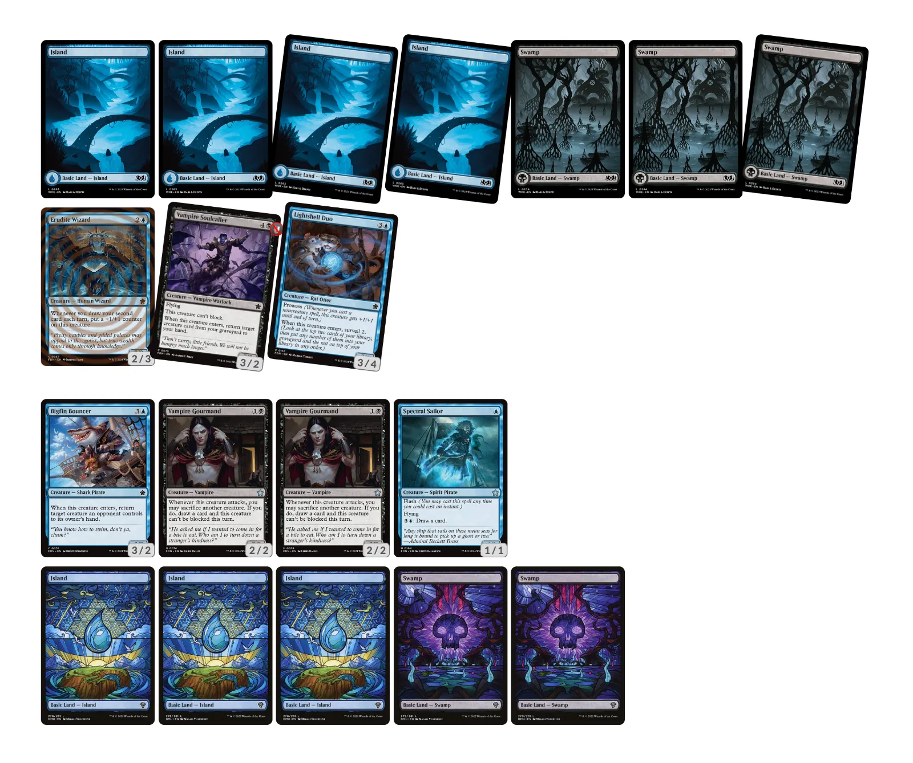

Per celebrar el [dia internacional del joc](https://www.un.org/en/observances/international-day-of-play), del 10 al 12 de juny es pot jugar a l'Arena el que anomenen un draft fanstasma (Phantom draft). És un draft que no té cost d'entrada (un Premier Draft normal costa ), però les cartes que tries per jugar no s'afegeixen a la teva col·lecció i tampoc hi ha premis rellevants: tens l'opció de guanyar un art alternatiu per una carta, diferent en funció del número de victòries.

No és una opció gaire engrescadora, però al cap i a la fi és una oportunitat per _draftejar_ una expansió diferent. En aquest cas [Foundations](https://scryfall.com/sets/fdn) (FDN), així que ho he provat, amb molt més èxit de l'esperat!



De seguida he vist que el draft em portava principalment cap al blau monocolor, tot i que en algun moment ha semblat que s'obrien possibilitats cap a {{< mana "{W}{U}" >}} Azorius i {{< mana "{U}{B}" >}} Dimir. Al final m'ha sortit una baralla principalment blava amb unes pinzellades de negre. A efectes pràctics, i estratègia de joc, una baralla [_Blue Tempo_](https://draftsim.com/mtg-blue-archetypes/); un arquetip que no acostumo a jugar però que m'agrada molt perquè, quan funciona, és molt satisfactori. La idea principal és ralentitzar el joc del rival amb counters i efectes de _bounce_, mentre l'anem atacant amb criatures. Algunes de les meves cartes més rellevants:



La veritat és que l'estratègia ha funcionat la mar de bé i tot i que he jugat algunes partides molt igualades, al final he acabat el draft invicte!

Ha sigut especialment emocionant i igualada la cinquena partida, en que tots dos jugàvem baralles similars, anàvem molt justos de vida, i tots dos teníem interacció a la mà.

Com es plantegen els atacs en aquesta taula? Tots dos estàvem a 5 punts de vida. Jo tenia  o  a la mà, i el meu oponent 3 cartes desconegudes i 4 terres obertes. Durant la partida vaig donar per fet que, si jo atacava amb tot, el rival intercanviaria el seu  pel meu  i donava per fet que tindria alguna mena d'interacció a la mà per a sobreviure. Vaig pensar que després del combat faria servir el meu  per desfer-me del seu 3/4 i sobreviure un torn més per atacar per guanyar...

El que no vaig considerar (error!) era que ell podia bloquejar un dels meus 2/2 sense perdre el seu defensor, deixant-lo en millor posició per contraatacar si tenia els recursos per sobreviure el meu atac. Afortunadament, per sobreviure, ell va haver de fer servir  que l'obligava a tornar una de les seves criatures a la mà i això em va salvar. Tot i que al torn posterior ell encara va posar un  en joc, vaig poder guanyar la partida gràcies a l'.
