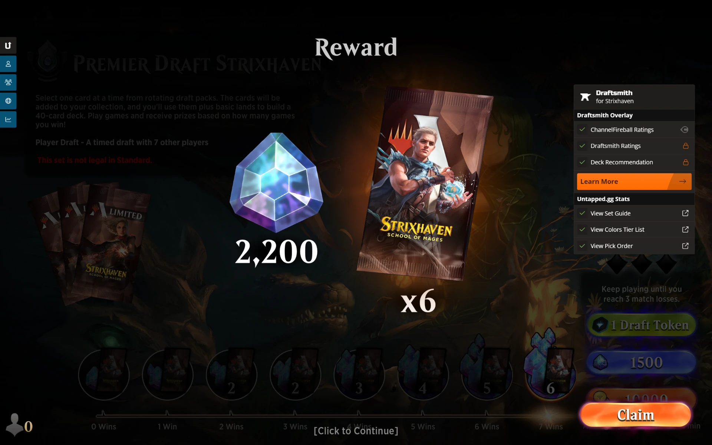

He començat, per error, un Premier Draft d'Strixhaven (pensant-me que era de _Secrets of_ Strixhaven) i me n'he adonat quan al primer sobre la carta rara era . Ja m'havia semblat estrany que trigués força més del normal a omplir-se la taula de draft... La meva primera reacció ha sigut: "–Merda, he llençat 1500 gemmes", pensant que l'experiència que havia acumulat en els 4 drafts anteriors de SOS no em serviria per a res. Però he tirat endavant, confiant que el [Draftsmith](https://mtga.untapped.gg/draftsmith) m'ajudaria, què havia de fer sinó!?

{{< draft index="1" set="STX" colors="{W}{B}" winrate="87" result="7-1" seventeenlands="c244983e4315486b9622a02b0e92e816" >}}

Curiosament, els primers sobres que he vist m'han tornar a dur cap al negre i la baralla ha acabat sent Orzhov, com en 2 dels 3 drafts anteriors que havia jugat. Suposo que el desconeixement dels arquetips de STX hi ha influït, portant-me cap a colors en què em sentia més còmode, perquè al p1p4 (Pack 1 Pick 4) he escollit un  per davant d'un .

Sigui com sigui, potser perquè hi havia poca gent jugant aquest draft (cada vegada que havia de començar una partida, m'havia d'esperar ben bé 2 o 3 minuts) o potser els rivals eren més novells que jo, o també s'havien equivocat de Set i no tenien un Companion que els ajudés a triar... el cas és que, després de la primera derrota quan anava 2-1, he anat encadenant victòries fins al 7-1 final. Ha sigut especialment emocionant la [6a partida](https://www.17lands.com/history/c244983e4315486b9622a02b0e92e816/5/0), que ha durat 20 torns! Però al final, després d'uns quants torns en què tots dos estàvem _top-decking_, l'_scry_ de  juntament amb ,  i un  que he robat a l'últim torn i m'ha donat el punt del mal extra (el rival estava a 3 de vida i jo a 4) per creuar la línia de meta.



La última partida, a més a més, l'he jugat contra un rival que tenia rang mític #1753 i també l'he guanyat. He estat molt content i m'he divertit!

Al final, he recuperat les gemmes que costa el draft i encara he tingut un benefici net de 700 gemmes i 6 sobres de STX!
